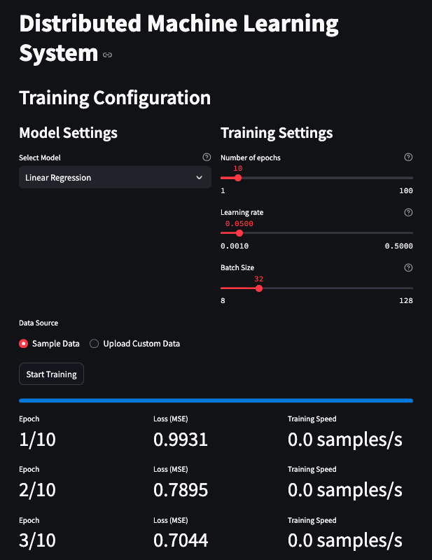

# Distributed Machine Learning Training System

A distributed machine learning training system with a web-based interface built using Streamlit. The system is designed to train machine learning models across multiple worker processes, enabling parallel processing and efficient resource utilization.

Core Architecture
The system follows a distributed architecture pattern with three main components:

    Web Interface Layer (main.py)

    Built with Streamlit for interactive model training
    Provides real-time visualization of training metrics
    Offers configuration controls for:
        Model selection (Linear, Ridge, Lasso Regression)
        Training parameters (learning rate, epochs, batch size)
        Data source selection
    Features interactive progress monitoring
    Real-time performance metrics visualization using Plotly

    Coordination Layer (coordinator.py)

    Manages distributed training across worker processes
    Implements parameter server pattern
    Handles gradient aggregation
    Manages inter-process communication using multiprocessing
    Tracks worker performance metrics

    Processing Layer

    Worker processes (worker.py)
    Data pipeline management (data_pipeline.py)
    Model implementations (models.py)

Technical Stack

    Core Framework: Python with Streamlit
    ML/Data Processing: NumPy, Pandas, scikit-learn
    Visualization: Plotly
    Process Management: Python's multiprocessing
    Performance Monitoring: psutil
    Data Format: CSV

Key Components

    Models (models.py)

    Base model class with common functionality
    Implementations for:
        Linear Regression
        Ridge Regression (L2 regularization)
        Lasso Regression (L1 regularization)
    Gradient computation
    Parameter updates

    Data Pipeline (data_pipeline.py)

    Memory-mapped data loading
    Data preprocessing and cleaning
    Batch generation
    Data partitioning for distributed processing

    Training Coordinator (coordinator.py)

    Worker process management
    Parameter broadcasting
    Gradient aggregation
    Inter-process communication
    Resource monitoring

    Metrics Collection (metrics.py)

    Training speed tracking
    Memory usage monitoring
    Compute time tracking
    Model performance metrics

    Utilities (utils.py)

    Logging configuration
    Performance metrics calculation
    Code block timing
    Error handling

Key Features

    Real-time training visualization
    Distributed processing
    Multiple model options
    Configurable hyperparameters
    Resource usage monitoring
    Performance metrics tracking
    Memory-efficient data handling
    Custom data support

Performance Optimizations

    Memory-mapped file reading
    Batch processing
    Parallel processing
    Efficient numpy operations
    Optimized gradient calculations

Deployment

    Runs on Replit's infrastructure
    Accessible via port 5000
    Streamlit-based web interface
    Automatic package management via pyproject.toml
